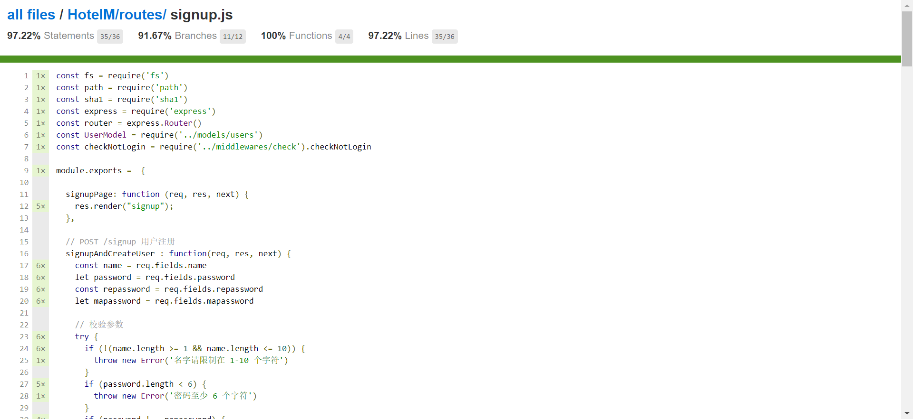
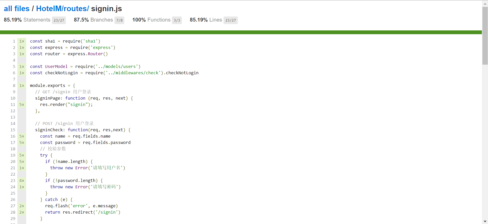
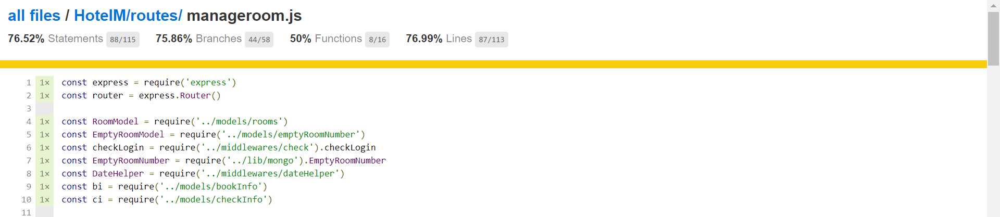
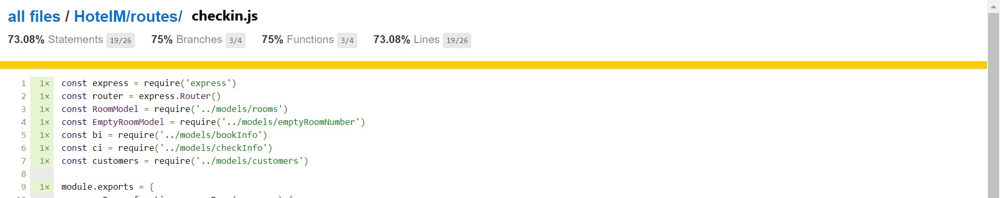

# HotelM测试文档

## 测试计划

由于本系统过于复杂，涉及到很多逻辑上的交互，以及表单的填写，所以测试样例必定非常之多，我们计划从代码的正确性和可读性上着手。

1. 通过划分多次使用的模块来提高代码的重用度和可读性
1. 通过利用mocha来实现样例的单元测试（只测试signin、signup、manageroom、checkin），验证表单提交的结果
1. 利用supertest来检验测试的覆盖度（虽然即使测试覆盖率达到 100% 也不能说明测试覆盖了所有的情况）

## 测试策略

**mocha** 和 **suptertest** 是常用的测试组合，通常用来测试 restful 的 api 接口，这里我们也可以用来测试我们的酒店管理系统应用。 在 HotelM 下新建 test 文件夹存放测试文件。

在前端和后端的各个文件中，我们可以析取出许多有着共同代码块的部分，将其封装，再重用，可以提高代码的可读性。

## 测试样例解析

    // 房间价格填写有误
    it('roomvalue wrong', function (done) {
      agent
        .post('/manageroom/updateroom')
        .type('form')
        .field({ starttime: "20200512", endtime:"20200713", roomtype:"单人房", roomvalue:"xyz", mapassword:"forbidden"})
        .redirects()
        .end(function (err, res) {
          if (err) return done(err)
          assert(res.text.match(/房间价格填写有误/))
          done()
        })
    })

如上述代码所示，可以检验当修改房间价格时，所填写的价格非数字的情况，通过接收到的error信息，利用正则表达式对比其中是否存在预料之中的错误信息来测试该判断分支的正确性。

    beforeEach(function (done) {
    // 创建一个用户
        User.create({
            name: testName1,
            password: '123456',
        })
            .exec()
            .then(function () {
            done()
            })
            .catch(done)
    })
    // 用户名被占用的情况
    it('duplicate name', function (done) {
        agent
            .post('/signup')
            .type('form')
            .field({ name: testName1,  password: '123456', repassword:'123456', mapassword: 'forbidden'})
            .redirects()
            .end(function (err, res) {
            if (err) return done(err)
            assert(res.text.match(/用户名已被占用/))
            done()
        })
    })

又如上述代码所示，可以检验当注册前台账户时，所填写的用户名被占用的情况，通过在每一次执行测试样例之前，创建一个用户，再利用模拟表单提交的形式试着创建相同用户名的用户，接收到的error信息，利用正则表达式对比其中是否存在预料之中的错误信息来测试该判断分支的正确性。

## 测试报告

查看上图均可知对于每个文件测试的覆盖率，包括：语句覆盖率、分支覆盖率、函数覆盖率以及行数覆盖率。由于时间有限并且本系统测试样例过多，只做了这几个文件的单元测试。
